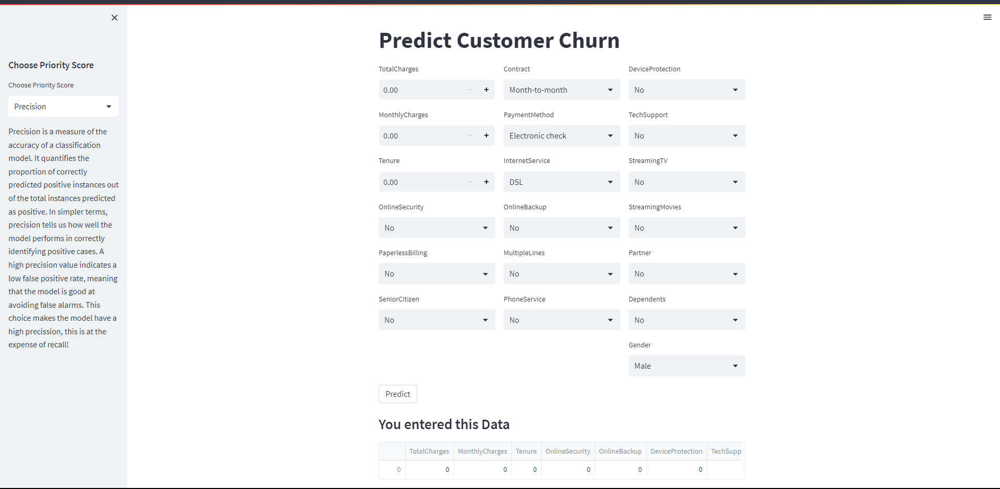

# Customer Churn Prediction



## Overview

This project focuses on predicting customer churn using various machine learning models. The project is structured into several modules and a Jupyter Notebook for data investigation and model testing.

The ML models investigated here are:
1. Logistic Regression Model
2. Random Forest Classifier
3. Support Vector Machine (SVM)
4. K Nearest Neighbors (KNN)
5. Naive Bayes
6. XGBoost

## Project Structure

- `customer_churn_prediction.ipynb`: This Jupyter Notebook is where the data is explored and models are tested. It imports the classes defined in `classes.py` to train and test the models.

- `classes.py`: This module defines the `MyInvestigator` class and subclasses for each model type. These classes encapsulate the common functionalities for different machine learning algorithms and allow for easy experimentation with different hyperparameters and data preprocessing techniques.

- `churn_app.py`: This is a Streamlit application that uses one of the trained models (the one that performs best) to predict customer churn. The model is loaded from a pickle file created in the Jupyter Notebook.

- `requirements.txt`: This file lists all the Python dependencies required to run this project.

## How to Run This Project

1. Clone the repository and navigate to the project directory.

2. Install the required dependencies using pip:

    ```bash
    pip install -r requirements.txt
    ```

3. Run the Jupyter Notebook to train and test the models:

    ```bash
    jupyter notebook customer_churn_prediction.ipynb
    ```

4. Run the Streamlit application:

    ```bash
    streamlit run churn_app.py
    ```

## About the Machine Learning Models

The `Investigate` classes in `classes.py` are designed to make it easy to experiment with different machine learning models. Each subclass corresponds to a different model type. These classes are used in the Jupyter Notebook to train and test the models on the customer churn data.

The models that performs the best in terms of precsion, recall and a balance between the tow, are saved as pickle files using joblib. These models are then loaded into the Streamlit application in `churn_app.py` to make predictions base on the user's choice.

## Streamlit App
The project is deployed using streamlit.
The Streamlit app is a simple web app that allows users to interactively explore the model's predictions on new data.
The User can choose a Priority Score which determines which model to use in the prediction.
 - The Priority Scores are "Recall", "Precision" and "Balance"
 - If the user chooses Balance, it will use a model with the most balance between Precision and Recall
 - If the user chooses Precision, it will use a model that is more focused on precision (less recall)
 - If the user chooses Recall, it will use a model that is more focused on recall (less precision)


## License

This project is licensed under the MIT License - see the [LICENSE](LICENSE) file for details.

## Conclusion

This project demonstrates a complete machine learning workflow, from data exploration and model training to deployment of a predictive model in a web application. It showcases the use of Jupyter Notebook for data analysis and model testing, and Streamlit for creating an interactive web application. If you like this book, give the repo a star ✨.
